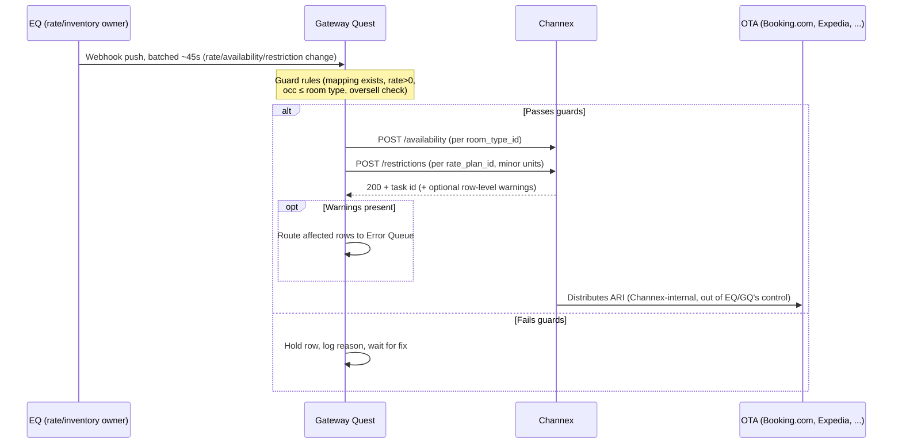
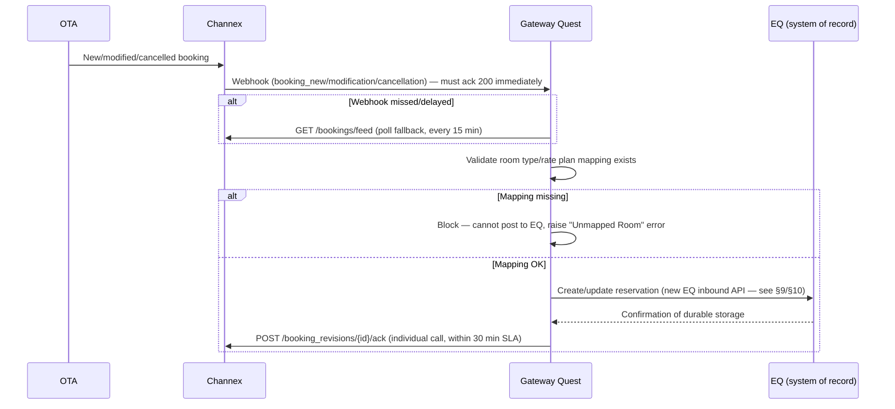

# Channex.io Integration — Analysis & Implementation Plan

**Scope:** EQ (`eq/backend`, `eq/frontend`) and the broader QUEST monorepo (`bq`, `pricing-service`) vs. the Channex.io channel-manager integration described in `gateway_quest_channex.html`.

**Status:** Analysis only. No code has been written or modified. Anything not directly evidenced in the codebase or in the HTML file is explicitly marked **[NEEDS VERIFICATION]**.

**Method:** Three independent research passes were run against (1) the full `gateway_quest_channex.html` file, (2) the full Prisma schema plus a repo-wide search for property/room/rate/availability/reservation/mapping/integration code, and (3) EQ's existing config/auth/DB/layering/scheduler/HTTP-client conventions. Findings are merged below.

---

## 0. Critical framing notes (read first)

1. **`gateway_quest_channex.html` is not a written spec — it's a working interactive mock UI.** It's a self-contained HTML/JS prototype of a "Gateway Quest" admin app, with an in-memory mock data model (`state.*`), mock API responses, and page logic. There is no such backend anywhere in this repo. Everything below attributed to "the mock" is **inferred from prototype behavior and copy text**, not from a formal API contract or actual Channex documentation. Treat field names, payload shapes, and rules extracted from it as a strong signal of intent, not a guaranteed-accurate Channex API contract — cross-check against real Channex API docs before implementation. **[NEEDS VERIFICATION]**
2. **"EQ" the folder is not "EQ" the running service.** `eq/backend`'s app self-identifies internally as **"AQ"**: FastAPI route prefix `/aq/api`, health check returns `{"service": "aq-backend"}`, tag `"AQ API-Vaish"`, and even the Prisma user/role/token models are named `aq_users`, `aq_roles`, `aq_tokens`, etc. The product name "Enterprise Quest" and the internal code name "AQ" are inconsistent throughout the codebase, not just cosmetically. Any new Channex module should decide explicitly whether to follow the existing internal `aq` convention (recommended, for consistency with everything else in this service) or introduce a new `eq` prefix — this is a naming decision, not something to silently guess. **[NEEDS VERIFICATION / DECISION]**
3. **Gateway Quest has no backend in this repo.** The only Gateway Quest artifacts found are: the `website/app/gateway-quest/page.tsx` marketing page, and the standalone HTML mock. There is no `gq/` or `gateway/` app alongside `eq/`, `bq/`, `cq/`, `pricing-service/`. This analysis therefore treats "Gateway Quest" as **a system that does not yet exist as real code** and must either be built as a new service/app, or the Channex integration logic must live inside `eq`/`bq` directly under a different name. Which of these is intended is a product/architecture decision outside the scope of this analysis. **[NEEDS VERIFICATION / DECISION]**
4. **EQ backend currently has no property/room/rate/booking domain code at all.** `eq/backend/app` only wires up `userManagement` and `settings` routers. The entire hotel-PMS domain (property, room type, room, pricing, booking, guest, billing) is implemented in **`bq/backend`**, even though the canonical Prisma schema (defining all of those models) is checked into `eq/backend/app/prisma/schema.prisma`.
5. **`eq`, `bq`, and `pricing-service` share one physical Postgres database/schema.** `bq/backend/app/prisma/schema.prisma` has a hardcoded connection string pointing at Postgres schema literally named `bq`; `eq` and `pricing-service` use `DATABASE_URL` pointing at the same place. The three apps each carry their **own copy** of `schema.prisma` and generate their **own** Prisma client independently. `eq`'s and `bq`'s copies are byte-identical except that `bq` additionally declares the restaurant/dining/print models; `pricing-service`'s is the same core minus restaurant/dining models. **Any DB change for Channex must be applied once at the physical DB level, then mirrored into all three `schema.prisma` files and regenerated three times.** There is no `migrations/` directory in any of the three apps — schema changes appear to be applied via `prisma db push` rather than tracked, reversible migrations. **[NEEDS VERIFICATION — confirm bq/pricing-service migration state directly, and confirm whether `db push` vs. `migrate` is the team's actual deployment process]**

---

## 1. Current EQ / Monorepo Inventory

### 1.1 `eq/backend` — what actually exists today

FastAPI app (`app/main.py`), Prisma (`prisma-client-py`) ORM, async, mounted at `/aq/api`. Only two functional modules:

- **`app/api/userManagement/`** — registration, login, roles, 2FA, OAuth (Google), phone OTP, password reset, token refresh/blacklist, admin user management. Flatter code style: routes call `prisma.userm.*` directly, no dedicated service layer.
- **`app/api/settings/`** — corporate settings: credit policy, notification templates, security settings, system settings/management, verification policy, settings dashboard. Clean **router → schema (Pydantic) → service (Prisma calls) → shared audit helper** layering, with a shared `APIResponse`/`success_response()`/`error_response()` envelope (`app/api/settings/responses.py`).

No property, room, rate, availability, reservation, channel, or integration code exists under `eq/backend/app/api` at all.

**Conventions confirmed (to be reused for Channex work):**

| Concern | Convention | File |
|---|---|---|
| Config | Plain class + `python-dotenv`, `os.getenv(...)`, env-driven URLs by `ENVIRONMENT` (dev/test/staging/prod) | `app/core/config.py` |
| DB | Singleton async `Prisma()` client; `connect_db()`/`disconnect_db()`/`get_prisma_client()` FastAPI dependency | `app/core/database.py` |
| Auth | JWT (`PyJWT`, `HS256`) + Firebase; `OAuth2PasswordBearer`. **Bug found:** `SECRET_KEY` in `core/auth.py` is hardcoded to a public jwt.io example string, not read from `settings.JWT_SECRET_KEY` — pre-existing issue, flag to whoever owns security, do not copy this pattern into new code | `app/core/auth.py` |
| Request context / audit | `get_request_context()` dependency reads `X-Forwarded-For`/`User-Agent` for audit `changed_by` fields | `app/api/settings/dependencies.py` |
| Layering to follow | router (thin, delegates) → Pydantic schema (`from_attributes=True`) → service (Prisma calls, raises `HTTPException`, calls `log_setting_change()`) | `app/api/settings/routers|schemas|services/system_settings.py` |
| Background jobs | `apscheduler.schedulers.asyncio.AsyncIOScheduler`, module-level scheduler, `start_*_job()` called from `@app.on_event("startup")` | `app/api/userManagement/routes/tokenCron.py` |
| Outbound HTTP | `httpx.AsyncClient()` used inline in route files; **no shared external-API client wrapper exists yet** — Channex would be the first integration to warrant one | `googleOauth.py`, `phoneotp.py` |
| Webhooks | **None exist anywhere in `eq/backend`.** No receiver routes, no signature verification, no idempotency handling | — |
| Dead/unwired code found | `app/dependencies.py` (top-level) is fully commented-out; `app/exceptionHandler.py`'s handlers are defined but never registered via `app.exception_handler(...)` in `main.py` | both files |
| Dependencies available | `fastapi`, `pydantic`, `uvicorn`, `prisma`, `asyncpg`, `redis`, `apscheduler`, `python-dotenv` in `requirements.txt`. `httpx` is used in code but **not pinned** in `requirements.txt` | `app/requirements.txt` |
| Frontend | `eq/frontend/src` has `Pages/Authentication`, `Pages/Dashboard`, `Pages/PasswordReset`, `commonComponent/` — **no Settings/Integrations area exists yet** to host a Channex config UI | `eq/frontend/src` |

### 1.2 Where the PMS domain actually lives: `bq/backend`

All property/room/pricing/booking business logic and routes live in `bq/backend/app/api/checkIn|checkOut|modification`, even though the shared schema is checked into `eq`.

**Existing routes relevant to this integration:**

| Method/Path (representative) | File |
|---|---|
| `POST/GET/PUT/DELETE /properties`, `/properties/{property_id}`, media endpoints | `bq/backend/app/api/checkIn/routes/masterdata.py` |
| `POST/GET/PUT/DELETE /roomtypes`, `/roomtypes/{roomtype_id}` | `masterdata.py` |
| `GET /roomtypes/`, `GET/POST /admin-roomtypes/`, `PUT /editadmin-roomtypes/{roomtypeid}` | `room_master.py` |
| `GET /bq/api/availability-room-type`, `GET /bq/api/propertydetails` | `room.py` |
| `GET /search-rooms-with-daterange/`, `/search-all-rooms-with-daterange/` | `availability.py` |
| `POST /create-reservation-walkin-new/`, `/create-reservation-online-new/`, `GET /bookings/`, `/reserved-bookings/`, `/current-bookings/`, `/bookings-by-guest-details/` | `booking.py` |
| `POST /modify-booking/`, `PUT /bookings/{booking_id}/full-update` | `bookingchange.py` / `bookingmodify.py` |
| `POST /cancel-booking/` | `cancelbooking.py` |
| `GET/POST /calculate-dynamic-price[-all]`, `/dynamic-prices-calendar`, `/dynamic-prices-summary` | `pricing-service/app/api/dynamicpricing.py`, `dynamicpricedata.py` |

**Important behavioral finding:** availability is **always computed live** — `room.status` diffed against overlapping `booking` rows for a date range. There is **no persisted per-date/per-room-type available count, closeout, or min/max-stay table anywhere** in the monorepo.

### 1.3 Current schema — full relevant model inventory

Source: `eq/backend/app/prisma/schema.prisma` (2036 lines; identical core to `bq`'s and `pricing-service`'s copies).

| Model | Key fields | Gap vs. Channex needs |
|---|---|---|
| `property` | `propertyid` (Int, PK), `propertyname`, `city`, `location`, `address`, `phone`, `email`, `checkin_time`/`checkout_time` (Time), `gstnumber`, etc. | **No `currency`, `country`, or `timezone` field at all.** Channex requires currency (ISO code) and timezone per property. |
| `roomtype` | `roomtypeid` (Int, PK), `propertyid`, `roomtypename`, `baseprice` (Decimal), `max_occupancy` (default 2) | No external/Channex ID field. No concept of a "rate plan" distinct from the room type's base price. |
| `room` | `roomid`, `roomnumber`, `roomtypeid`, **`status String`** (free text, not enum) | Not directly Channex-relevant, but the free-text status field is a latent data-quality risk for any status-driven sync logic. |
| `dynamicprice` | per-date price override per room type (`effectivedate Date`, `dynamicprice Decimal`) | Closest existing concept to a rate calendar, but it's a price override, not a full rate-plan (no restrictions, no per-plan occupancy, no sell_mode). |
| `contractroompricing` | date-ranged contract-specific pricing | Same limitation — pricing only, no restrictions, no channel awareness. |
| `booking` | composite PK `[orderid, bookingid]`, `guestid`, `booking_status` (free text), **`checkindate`/`checkoutdate` are `String?`, not `Date`/`DateTime`** | No channel/source field, no external booking reference, no revision/ack tracking. String-typed dates are a real risk for any date-range logic Channex sync will need — flagged, not something to silently work around. |
| `restaurant_foodorder` (and siblings) | `platform_name`, `platform_order_id`, `platform_status`, `platform_metadata Json?`; enum `restaurant_order_type` includes `swiggy`, `zomato`, `other_platform` | **This is the one existing precedent in the codebase for "order came from an external platform."** Worth reusing as the design template for how Channex-sourced bookings/channels should be modeled (see §8). |
| `audit_log` | generic `entity_type`, `entity_id`, `old_values`/`new_values` (Json) | Reusable as-is for Channex audit trail — no new audit table needed (see §7). |

**Confirmed absent, monorepo-wide** (checked via repo-wide search across `eq`, `bq`, `cq`, `pricing-service`, `website`, excluding `node_modules`/`.venv`/`.git`):

- No rate-plan/rate-code model distinct from `roomtype.baseprice` + `dynamicprice`.
- No per-date inventory/allotment/stop-sell/restrictions table.
- No channel/OTA model of any kind.
- No `external_id` / `third_party_id` / mapping columns on any model.
- No multi-currency field anywhere on `property`.
- **No channel-manager, OTA, webhook-receiver, or Channex code exists anywhere in the monorepo.** The only "webhook" hits found are unrelated Razorpay payment webhooks in `bq/backend/app/api/checkIn/routes/razorpay.py` and `restaurant_payment.py`. The only "channel manager" hits are marketing copy on the `website` app describing it as a feature, not code.

---

## 2. Channex / Gateway Quest Requirements (extracted from the mock)

### 2.1 Channex APIs referenced in the mock

| API | Direction | Purpose / notes |
|---|---|---|
| `GET /properties` | Gateway Quest → Channex | Test-connection / account verification |
| `POST /properties` | Gateway Quest → Channex | Create a Channex property; response `property_id` stored against the EQ property before any ARI can be pushed |
| `POST /availability` | Gateway Quest → Channex | Push availability, batched **per property**, keyed by `room_type_id`. Rate-plan availability is derived by Channex from this — never pushed twice |
| `POST /restrictions` | Gateway Quest → Channex | Push rates **and** restrictions together (min-stay arrival/through, max-stay, CTA, CTD, stop-sell), keyed by `rate_plan_id`, values in **minor currency units** |
| `GET /bookings/feed` | Gateway Quest → Channex | Booking revisions feed; polled every 15 min as a fallback to webhooks |
| `POST /booking_revisions/{id}/ack` | Gateway Quest → Channex | Acknowledge one booking revision after it is durably stored in EQ. **No batch-ack endpoint exists** — every ack is an individual call |
| Room type / rate plan listing | implied, not explicitly called | The mock treats a pre-existing "Channex pool" of room types/rate plans as available to map against. Exact Channex endpoint (e.g. `GET /room_types`, `GET /rate_plans`, `GET /channels`) **not shown in the mock — confirm against real Channex API docs.** **[NEEDS VERIFICATION]** |
| Webhook registration | Channex-side config, mirrored in the UI | Callback URL, secret, selectable event types |

**None of the above are implemented anywhere in this monorepo today — all are net new.**

### 2.2 Data flow, as designed in the mock

Strict one-directional ownership model, explicitly stated in the mock's help copy:

1. **EQ owns and decides** every rate, availability, and restriction value; it pushes changes outward.
2. **Gateway Quest never edits, overrides, or rejects** EQ's data — it is a pure pass-through + technical gatekeeper. It only *holds back* a row when Channex would reject it (missing mapping/onboarding, invalid value), then auto-resumes once fixed.
3. **Channex is the only channel-manager middleware** Gateway Quest talks to — batched into `POST /availability` (room-type level) and `POST /restrictions` (rate-plan level).
4. **OTAs** (Booking.com, Expedia, Airbnb, Agoda, Hostelworld, Trip.com) are reached exclusively through Channex — Gateway Quest never talks to an OTA directly.
5. Bookings return via Channex's booking-revisions feed and are acknowledged only after EQ has durably stored them.

**EQ → Gateway Quest (inbound ARI ingestion into Gateway Quest):** mock config shows `EQ.endpoint = https://eq.rhombusquest.com/api/v1/ari/outbound`, `EQ.mode = "Push (webhook)"`, `EQ.batchSeconds = 45`. This implies **EQ pushes** rate/availability/restriction changes to Gateway Quest via webhook, batched every 45s by default (configurable 5–300s). Note the path shape (`/api/v1/ari/outbound`) does **not** match EQ's actual existing prefix (`/aq/api/...`) — this endpoint does not exist today and its exact contract is only inferred from mock UI copy. **[NEEDS VERIFICATION]**

Each inbound EQ message decomposes into review-queue line items (kind: rate/availability/restriction; target id; date range; field; EQ-sent value; currently-live value; decision: Pending → Forwarded/Held), each evaluated against guard rules before being forwarded.

**Gateway Quest → Channex (outbound ARI push), payload shapes shown in the mock:**

```json
// POST /availability
{ "values": [ { "property_id": "<cx property_id>", "room_type_id": "<cx room_type_id>", "date_from": "YYYY-MM-DD", "date_to": "YYYY-MM-DD", "availability": <int> } ] }
```
```json
// POST /restrictions
{ "values": [ { "property_id": "<cx property_id>", "rate_plan_id": "<cx rate_plan_id>", "date_from": "YYYY-MM-DD", "date_to": "YYYY-MM-DD", "rate": <int, minor units>, "min_stay_arrival": <int>, "min_stay_through": <int>, "max_stay": <int>, "cta": <bool>, "ctd": <bool>, "stop_sell": <bool> } ] }
```

A `200 OK` can still carry **row-level warnings** (rejected rows even though the outer call succeeded):

```json
{ "data": [], "meta": { "message": "Success", "warnings": [ { "property_id": "...", "date_from": "2026-08-22", "date_to": "2026-08-31", "rate": "-2", "warning": { "rate": ["must be greater than 0"], "min_stay_arrival": ["must be greater than or equal to 1"] } } ] } }
```

Each push returns a task with status `Applied` / `Applied with warnings` / `Processing` / `Failed`, plus a warning count.

**Channex → Gateway Quest → EQ (bookings, inbound):** webhook push (primary) + poll fallback on the booking feed every 15 min. Revision fields: `id`, `bookingId`, `uniqueId`/`otaCode` (OTA's own reference), `ota`, `pid`, `status` (`new`/`modified`/`cancelled`), `guest`, `amount` (minor units), `arrival`/`departure`, `acked`, `err`. **Ack SLA: 30 minutes** from first receipt. A revision cannot be acked if its room type/rate plan has no Channex mapping.

### 2.3 Entities / fields implied by the mock's data model

| Entity | Fields |
|---|---|
| **Property** | `id`, `name`, `eqCode`, `cxId` (Channex `property_id`, nullable until onboarded), `active`, `currency` (ISO), `minStayType` (`both`/`arrival`), `onboarded`, `country`, `timeZone`, `defaultRatePlan` (FK), `defaultInventory`, `syncFrequency` (15s/30s/1min/5min), `reservationSyncMode` (push+poll / push-only / pull-only) |
| **Room Type** | `id`, `pid` (FK property), `eqName`, `cxId` (Channex `room_type_id`), `cxTitle`, `occ` (max occupancy), `count` (physical rooms), `mapped` |
| **Rate Plan** | `id`, `pid`, `rtId` (FK room type — **belongs to exactly one room type**), `eqName`, `cxId` (Channex `rate_plan_id`), `cxTitle`, `sellMode` (`per_room`/`per_person`), `occ` (**must not exceed parent room type's occ** — hard Channex validation), `mapped` |
| **Channel** (OTA connection inside Channex) | `id`, `code` (`BookingCom`/`Expedia`/`AirBNB`/`Agoda`/`HostelWorld`/`Ctrip`), `name`, `pid`, `status`, `mappedRooms`/`totalRooms`, `lastSync`, `bookings30d` |
| **Availability row** | `pid`, `rtId`, `dateFrom`/`dateTo`, `eqValue`, `cxValue`, `status` (`Pending push`/`In sync`/`Blocked`) |
| **Rate row** | `pid`, `rpId`, `dateFrom`/`dateTo`, `eqValue` (minor units), `cxValue`, `status` |
| **Restriction row** | `pid`, `rpId`, `minArr`, `minThr`, `maxStay`, `cta`, `ctd`, `stopSell`, `status` |
| **Task** (push audit) | `id`, `pid`, `endpoint`, `rows`, `status`, `warnings`, `at` |
| **API log** | `id`, `method`, `endpoint`, `code`, `ms`, `pid`, `warnings`, `at` |
| **Webhook log** | `id`, `event`, `ref`, `attempt` (of 11), `code`, `at`, `next` |
| **Booking revision** | see §2.2 |
| **Error** | `id`, `ref`, `kind` (`Rate Limit (429)`/`Validation`/`Channex Warning`/`Unmapped Room`), `pid`, `detail`, `retries`, `status` (`Pending`/`Resolved`/`Dismissed`), `at` |
| **Audit** | `id`, `at`, `who`, `cat`, `what` |

**ID mapping model in the mock:** flattened 1:1 — `cxId`/`cxTitle` stored directly on the EQ-side property/room-type/rate-plan row, not a separate generic mapping table. Duplicate-target mapping is explicitly guarded against in the UI.

### 2.4 Authentication

- **One Channex API key per account** (not per property), header `user-api-key`, format `ck_stg_...` in staging.
- Two environments: Staging (`https://staging.channex.io/api/v1`) vs. Production (`https://secure.channex.io/api/v1`).
- Key rotation flow re-tests the connection immediately.
- Webhook callback URL must be HTTPS; a webhook secret is configured (presence flag only — **actual signature-verification mechanism not shown in the mock**). **[NEEDS VERIFICATION]**
- Gateway-Quest-internal RBAC (Super Admin/Admin/Hotel Admin/Support User) is explicitly flagged in-app as **"Preview only — not real authentication. Remove before production."**

### 2.5 Webhooks

- Default callback: `https://gwq.rhombusquest.com/hooks/channex` (placeholder — needs a real domain decision).
- 10 subscribed event types: `booking_new`, `booking_modification`, `booking_cancellation`, `booking_unmapped_room`, `booking_unmapped_rate`, `non_acked_booking`, `ari`, `sync_error`, `sync_warning`, `rate_error`.
- Max inbound message size: 10 MB.
- Retry/backoff: up to **11 attempts** over ~24h (1m, 2m, 4m, 8m, 15m, 30m, 1h, 2h, 4h, 6h, 10h).
- **Receiver contract: must always return 200**, even if downstream EQ processing fails — failures must be handled via internal retry/queue, not by failing the webhook response.
- Explicitly "a delivery accelerator, not a guarantee" — 15-min poll fallback is required regardless.

### 2.6 Sync / scheduling

- Outbound batching window: default 45s per property, configurable 5–300s.
- Availability and rate/restriction pushes are **always separate** API calls, never combined.
- Per-property `syncFrequency` (15s/30s/1min/5min) — **semantics ambiguous in the mock (EQ→GWQ vs. GWQ→Channex direction unclear).** **[NEEDS VERIFICATION]**
- Per-property `reservationSyncMode`: push+poll / push-only / pull-only.
- Booking feed poll fallback: every 15 min.
- "Nightly full ARI refresh" toggle, default ON.
- Rate limit: ~10 requests/min per property → HTTP 429 on excess.
- Conflict resolution: Channex processes FIFO with last-write-wins; no versioning/optimistic-locking modeled — EQ is treated as sole source of truth.

### 2.7 Error handling

Guard rules run **before** any push is attempted (client-side pre-validation): rate must be > 0; mapping must exist; rate-plan occupancy ≤ room-type occupancy; availability ≤ physical room count if the "oversell guard" setting is on; a row still awaiting EQ forwarding cannot be pushed early. Error kinds tracked: `Rate Limit (429)`, `Validation`, `Channex Warning` (row-level warning inside a 200), `Unmapped Room`. Every error has a `retries` counter and status (`Pending`/`Resolved`/`Dismissed`); dismissing leaves the data permanently unsynced (explicit warning in-app).

### 2.8 Testing / certification

**Not addressed in the mock at all** — no reference to a Channex partner-certification process, sandbox onboarding steps beyond the staging/production base-URL toggle, or a formal test suite. Must be sourced from actual Channex partner documentation before implementation. **[NEEDS VERIFICATION]**

---

## 3. Gap Analysis

| Channex/Gateway Quest requirement | Current EQ/monorepo state | Gap |
|---|---|---|
| Property has Channex `property_id`, currency, timezone, country, onboarding status | `property` has none of these | **New fields required** |
| Room type mapped to Channex `room_type_id` | `roomtype` has no external-ID field | **New field required** |
| Rate plan (1 room type → many rate plans, `sell_mode`, occupancy ≤ room type's) | **No rate-plan concept exists** — only `roomtype.baseprice` + `dynamicprice` | **New table required** |
| Per-date restrictions (min/max stay, CTA, CTD, stop-sell) | **Does not exist anywhere** | **New table required** |
| Per-date availability as a discrete pushable value | Computed live from `room.status` + bookings; no persisted count | **Decision needed**: push the live-computed value directly, or persist a synced snapshot (see §7) |
| Channel/OTA model (per-property mapping coverage, status) | Does not exist | **New table required** |
| Booking ↔ Channex revision / OTA reference / ack tracking | `booking` has no channel/source/external-reference/ack fields | **New child table required** (not a `booking` column bolt-on — see §8) |
| Outbound push audit (tasks, API logs) | Does not exist | **New tables required** |
| Inbound webhook log, error queue | Does not exist | **New tables required** |
| Generic audit trail | `audit_log` already exists (entity_type/entity_id/old_values/new_values Json) | **Reusable as-is** |
| Channex API client (auth header, base URL, retry) | No shared external-API client pattern exists in `eq` at all | **New module required** |
| Webhook receiver + signature verification | Does not exist anywhere | **New endpoint(s) required** |
| Background ARI sync / poll jobs | `apscheduler` pattern exists (`tokenCron.py`) but nothing Channex-specific | **New jobs required, reuse existing scheduler pattern** |
| Config for Channex API key / webhook secret / base URL | No third-party-credential convention exists in `config.py` yet | **New env vars + config fields required** |
| Gateway Quest backend itself | **Does not exist in this repo** | **Architecture decision required before any of the above can be wired end-to-end** |

---

## 4. Required Data Flows

### 4.1 EQ → Gateway Quest → Channex → OTA (ARI push)



### 4.2 OTA → Channex → Gateway Quest → EQ (booking ingestion)



**Note:** step "GQ → EQ: Create/update reservation" requires a **new inbound (write) endpoint on the EQ/bq side** that does not exist today — this is a necessary counterpart to the GET APIs in §9, called out explicitly here since the user's data-flow question spans both directions even though §9 only asked about GETs.

---

## 5. Required Database Changes

**Process note (applies to everything below):** because `eq`, `bq`, and `pricing-service` each carry an independent copy of `schema.prisma` against the same physical DB, every model/field change listed here must be added to **all three** `schema.prisma` files identically (pricing-service only needs the fields it actually reads, at minimum `rate_plan` and `property` currency/mapping fields, to be confirmed), followed by `prisma generate` in each app. There is no tracked migration history today (`prisma db push` appears to be the process) — introducing real migrations before this integration ships is strongly recommended given the schema is about to take on external-system dependencies, but that decision is outside this analysis's scope.

### 5.1 Modify existing tables

**`property`** — add:
| Field | Type | Notes |
|---|---|---|
| `currency` | `String` | ISO 4217 code; **completely absent today** |
| `country` | `String?` | Absent today |
| `time_zone` | `String?` | Absent today |
| `cx_property_id` | `String? @unique` | Channex `property_id` (UUID) |
| `cx_onboarded` | `Boolean @default(false)` | |
| `cx_min_stay_type` | `String?` | `both` \| `arrival` |
| `cx_default_rate_plan_id` | `Int?` | FK to new `rate_plan` |
| `cx_default_inventory` | `Int?` | |
| `cx_sync_frequency` | `String?` | see §2.6 open question before finalizing as enum |
| `cx_reservation_sync_mode` | `String?` | push+poll / push-only / pull-only |

**`roomtype`** — add:
| Field | Type | Notes |
|---|---|---|
| `cx_room_type_id` | `String? @unique` | Channex `room_type_id` |
| `cx_title` | `String?` | Channex-side display name |

**`booking`** — no direct field bolt-ons recommended (see §8 rationale for a child table instead). **[NEEDS VERIFICATION]** whether `checkindate`/`checkoutdate` being `String?` instead of `Date`/`DateTime` needs to be fixed as a prerequisite — this is a pre-existing data-quality issue that any date-range ARI/reservation sync logic will be sensitive to; flagging rather than silently working around it.

### 5.2 New tables

**`rate_plan`** — the core missing entity:
`id` (PK), `property_id` (FK), `room_type_id` (FK — one room type → many rate plans), `name`, `sell_mode` (`per_room`/`per_person`), `occupancy` (Int, must be ≤ parent room type's `max_occupancy` — application-level constraint), `is_default` (Bool), `cx_rate_plan_id` (String, unique, nullable), `cx_title` (String, nullable), `mapped` (derivable from `cx_rate_plan_id IS NOT NULL`, or stored), `created_at`, `updated_at`.

**`rate_restriction`** — per-date, per-rate-plan restrictions (does not exist in any form today):
`id` (PK), `rate_plan_id` (FK), `date_from`, `date_to`, `min_stay_arrival` (Int), `min_stay_through` (Int), `max_stay` (Int), `cta` (Bool), `ctd` (Bool), `stop_sell` (Bool), `sync_status` (enum — see §5.3), `created_at`, `updated_at`.

**`channel`** — OTA connections as surfaced by Channex per property:
`id` (PK), `property_id` (FK), `code` (e.g. `BookingCom`, `Expedia`, `AirBNB`, `Agoda`, `HostelWorld`, `Ctrip`), `name`, `status` (`Active`/`Warning`/`Not mapped`/`Paused`), `mapped_rooms_count`, `total_rooms_count`, `last_sync_at`, `bookings_30d`, `updated_at`.

**`channex_booking_revision`** — booking sync/ack tracking (child of `booking`, 1:many since a booking can have multiple revisions):
`id` (PK), `order_id`/`booking_id` (FK, composite matching `booking`'s composite PK), `cx_revision_id`, `cx_booking_id`, `ota_code` (OTA's own reference), `channel_id` (FK `channel`, nullable), `status` (`new`/`modified`/`cancelled`), `guest_name`, `amount_minor_units`, `arrival_date`, `departure_date`, `received_at`, `acked_at`, `ack_status` (`pending`/`acked`/`blocked`), `blocking_reason` (nullable text), `created_at`.

**`channex_push_task`** — outbound ARI push audit:
`id` (PK, Channex task id), `property_id` (FK), `endpoint` (`/availability`/`/restrictions`), `row_count`, `status` (`applied`/`applied_with_warnings`/`processing`/`failed`), `warning_count`, `created_at`.

**`channex_api_log`** — every outbound Channex API call:
`id` (PK), `method`, `endpoint`, `http_status`, `latency_ms`, `property_id` (nullable, for account-level calls), `warning_count`, `created_at`.

**`channex_webhook_log`** — every inbound Channex webhook delivery:
`id` (PK), `event`, `ref` (correlates to booking/task/log), `attempt` (1–11), `http_status_returned`, `received_at`, `next_retry_at` (nullable).

**`channex_error_queue`** — unresolved sync errors:
`id` (PK), `ref` (FK-ish pointer to originating task/log/booking id), `kind` (`rate_limit`/`validation`/`channex_warning`/`unmapped_room`), `property_id` (FK), `detail` (text), `retries` (Int), `status` (`pending`/`resolved`/`dismissed`), `created_at`, `resolved_at`.

**`channex_account_config`** — single account-level connection config (not per-property, since the Channex API key is account-scoped):
`id` (PK, likely singleton or one per corporate account), `api_key` (encrypted at rest), `environment` (`staging`/`production`), `webhook_url`, `webhook_secret` (encrypted at rest), `default_batch_window_seconds` (default 45), `nightly_full_refresh_enabled` (Bool, default true), `oversell_guard_enabled` (Bool), `ack_only_after_store_enabled` (Bool), `updated_at`, `updated_by`.

Audit trail: **reuse the existing `audit_log` model** (`entity_type`/`entity_id`/`old_values`/`new_values` Json) rather than adding a new Channex-specific audit table — tag `entity_type` values like `channex_mapping`, `channex_push`, `channex_booking_ack`, etc.

### 5.3 New enums

- `channex_sync_status`: `pending` | `forwarded` | `held` | `applied` | `applied_with_warnings` | `failed` (used on `rate_restriction` and analogous availability/rate rows).
- `channex_ack_status`: `pending` | `acked` | `blocked`.
- `channex_environment`: `staging` | `production`.

Consider extending the existing `restaurant_order_type` enum pattern (which already has `swiggy`/`zomato`/`other_platform`) as a **precedent**, not a literal reuse target — Channex channels are a different domain (OTA distribution, not food-delivery orders) and deserve their own `channel.code` field rather than folding into that enum.

### 5.4 Where availability values come from (open design question)

Two options, **neither confirmed by the mock or codebase — decision needed:**
- **(a)** Continue computing availability live (current `bq` pattern: physical room count minus overlapping bookings) at push time, with no new persisted table — simplest, but means the "oversell guard" and any cx-vs-eq value comparison must be computed on demand.
- **(b)** Introduce a persisted `inventory_snapshot`/`availability_calendar` table (per room type, per date, available count) that the ARI-push job reads from, decoupling "what EQ currently thinks availability is" from a live query. Matches the mock's `availRows.eqValue`/`cxValue` comparison model more directly, but is a bigger schema addition.

**[NEEDS VERIFICATION / DECISION]** — recommend (b) if the "oversell guard" and cx-vs-eq comparison UI shown in the mock is a real product requirement, since (a) can't cheaply reconstruct historical eq-vs-cx state for the monitoring/report screens described in §2.

---

## 6. Channex ID ↔ Quest ID Mapping Strategy

**Recommendation: flattened 1:1 fields on the source entity**, matching both the mock's own `cxId` pattern and the existing in-repo precedent (`restaurant_foodorder.platform_order_id`) — not a generic polymorphic mapping table:

- `property.cx_property_id`
- `roomtype.cx_room_type_id`
- `rate_plan.cx_rate_plan_id`

This is appropriate because these are genuinely 1:1, low-cardinality relationships that rarely change once mapped, and a flattened field is simpler to query/index than a generic `(entity_type, entity_id, external_id)` mapping table.

**Exception: bookings are 1:many** — one EQ `booking` can have multiple Channex revisions over its lifecycle (new → modified → cancelled), so this is modeled as the separate `channex_booking_revision` child table (§5.2), not a column on `booking` itself. This mirrors how the mock itself models `bookingId` (EQ-stable) vs. `id`/revision (Channex-side, changes per event).

**Constraint to enforce at the application layer (not expressible in Prisma alone):** two EQ rows must never point at the same Channex id within a property — the mock explicitly guards against this ("the last one would win"); enforce via a unique index on `cx_room_type_id`/`cx_rate_plan_id` plus application-level validation during the mapping flow.

---

## 7. GET APIs Gateway Quest Needs to Consume From EQ

None of these exist today. All are net new, and all should live on whichever app ends up owning the PMS domain execution (**`bq`**, per current routing — see §0.4) even though the schema is authored in `eq`. **[NEEDS VERIFICATION / DECISION — confirm intended owning service before implementation.]**

| Purpose | Proposed endpoint (illustrative) | Consumed for |
|---|---|---|
| List properties + onboarding/mapping state | `GET /channex/properties` | Initial onboarding, mapping screens, reconciliation |
| List room types for a property, with mapping state | `GET /channex/properties/{id}/roomtypes` | Room Type Mapping page |
| List rate plans for a property/room type, with mapping state | `GET /channex/properties/{id}/rateplans` | Rate Plan Mapping page |
| Current live availability for a date range (room type) | `GET /channex/properties/{id}/availability?from=&to=` | Reconciliation / comparing `cxValue` vs `eqValue`; nightly full refresh |
| Current live rates + restrictions for a date range (rate plan) | `GET /channex/properties/{id}/rates?from=&to=` | Same as above, rates side |
| Lookup a booking by internal id, to confirm durable storage before acking Channex | `GET /channex/bookings/{order_id}/{booking_id}` | Gate the `POST /booking_revisions/{id}/ack` call — Gateway Quest must confirm EQ has the booking before acking Channex |
| Full ARI snapshot for a property (nightly refresh) | `GET /channex/properties/{id}/ari-snapshot?from=&to=` | "Nightly full ARI refresh" feature described in the mock |

These are **read** endpoints; the corresponding **write** path (EQ receiving bookings pushed from Gateway Quest, per §4.2) is a separate, new inbound endpoint not covered by this list but noted as a dependency in §4.2.

---

## 8. Exact Files to Create / Modify

**Caveat:** file paths below assume the Channex integration is implemented as a new module inside the existing `eq`/`bq` apps, following existing conventions, since Gateway Quest has no backend of its own in this repo (§0.3). If the team decides Gateway Quest should be a standalone service, this entire section needs to be re-scoped to a new app (e.g. `gq/backend`) mirroring the same directory conventions — **treat the paths below as the "integration lives inside EQ/BQ" scenario only.** **[NEEDS VERIFICATION / DECISION]**

### 8.1 Schema (all three apps, kept in sync)
- `eq/backend/app/prisma/schema.prisma` — add models/fields from §5 (source of truth copy)
- `bq/backend/app/prisma/schema.prisma` — mirror the same additions (bq executes the PMS routes)
- `pricing-service/app/prisma/schema.prisma` — mirror at minimum `rate_plan` and `property` currency fields if pricing-service needs to be Channex-aware

### 8.2 New EQ backend module (config/mapping/admin surface)
- `eq/backend/app/api/channex/__init__.py`
- `eq/backend/app/api/channex/client.py` — Channex HTTP client wrapper (`httpx.AsyncClient`, `user-api-key` header, staging/prod base URL, following the existing inline-`httpx` convention but centralized since Channex is the first integration to need a shared client)
- `eq/backend/app/api/channex/routers/connection.py` — account config, test connection, key rotation
- `eq/backend/app/api/channex/routers/mapping.py` — property/room-type/rate-plan mapping CRUD
- `eq/backend/app/api/channex/schemas/*.py` — Pydantic request/response models
- `eq/backend/app/api/channex/services/*.py` — Prisma calls + Channex client calls, following the `settings` module's service-layer pattern
- `eq/backend/app/core/config.py` — add `CHANNEX_API_KEY`, `CHANNEX_WEBHOOK_SECRET`, `CHANNEX_ENVIRONMENT`, `CHANNEX_BASE_URL_STAGING`/`_PRODUCTION` env vars, following existing `os.getenv(...)` style
- `eq/backend/app/main.py` — register new Channex routers under `/aq/api/channex/...` (or a decided prefix, per §0.2), register the ARI-sync scheduler job on startup (following `tokenCron.py`'s `apscheduler` pattern)
- `eq/backend/app/requirements.txt` — pin `httpx` explicitly

### 8.3 New BQ backend module (operational sync surface — since bq owns property/room/booking execution today)
- `bq/backend/app/api/channex/routers/ari_push.py` — availability/restrictions push jobs, guard-rule pre-validation
- `bq/backend/app/api/channex/routers/bookings.py` — webhook receiver (`POST /webhooks/channex`) + poll-fallback job + ack flow
- `bq/backend/app/api/channex/routers/reads.py` — the GET APIs from §7
- `bq/backend/app/api/channex/services/*.py` — guard-rule evaluation, payload building (matching §2.2 payload shapes), task/log/error persistence

### 8.4 Frontend
- `eq/frontend/src/Pages/Integrations/Channex/` (new directory — no existing Settings/Integrations area to extend, per §0.1) for: connection settings, property/room/rate mapping screens, distribution push monitoring, error queue — scope and priority of which mock screens (§2's UI inventory) get built is a product decision, not inferred here.

### 8.5 Explicitly NOT determined by this analysis
- Whether a new `gq/backend` app should be created instead of embedding Channex logic in `eq`/`bq`.
- Exact route prefix (`/aq/api/channex` vs. something else).
- Whether `pricing-service` needs any Channex-awareness beyond read access to `rate_plan`.

---

## 9. Authentication, Configuration, Error Handling, Sync, Webhook, Testing Requirements

### 9.1 Authentication
- Store the Channex API key and webhook secret **encrypted at rest** (`channex_account_config` table) — no existing convention for encrypted secrets was found in this codebase; this would be new. **[NEEDS VERIFICATION — confirm the team's preferred secrets approach: DB encryption, a secrets manager, or env-var-only.]**
- Follow the existing `config.py` env-var convention for any deployment-level Channex settings (base URLs, default environment).
- Do **not** model the mock's account-config RBAC ("Preview only — not real authentication") as real auth — EQ already has a JWT/role system (`aq_users`/`aq_roles`) that should gate any new Channex admin UI/API, reusing existing `core/auth.py` patterns (after fixing the hardcoded `SECRET_KEY` bug, ideally, though that's a pre-existing issue outside this integration's scope).

### 9.2 Configuration
New env vars needed (naming illustrative, following existing `UPPER_SNAKE_CASE` convention in `config.py`): `CHANNEX_ENVIRONMENT`, `CHANNEX_API_BASE_URL_STAGING`, `CHANNEX_API_BASE_URL_PRODUCTION`, `CHANNEX_WEBHOOK_PATH`, plus DB-stored per-account key/secret as noted above (env var storage of a rotatable API key is likely wrong long-term — DB storage with rotation support matches the mock's "Rotate API key" flow).

### 9.3 Error handling
Implement the three-tier model shown in the mock: (1) pre-push guard rules (client-side validation before calling Channex — mapping exists, rate > 0, occupancy constraint, oversell check), (2) transport-level errors (429 rate limit, 5xx, timeouts — retry with backoff), (3) row-level warnings embedded in 200 responses (must be parsed out of the `meta.warnings` array and routed to the error queue, not treated as success). All three tiers feed `channex_error_queue` with a `retries` counter and manual `resolve`/`dismiss` actions.

### 9.4 Synchronization
- Outbound: batch changes per property over a configurable window (default 45s), always send availability and rates/restrictions as separate calls, respect ~10 req/min/property rate limit, support a nightly full-refresh job (reuse `apscheduler` pattern).
- Inbound bookings: webhook-primary with mandatory 15-min poll fallback; ack only after durable EQ storage; respect the 30-min ack SLA; one ack call per revision (no batching).
- Conflict resolution: none needed on the EQ→Channex side beyond FIFO/last-write-wins, since EQ is sole source of truth per the mock's design.

### 9.5 Webhook requirements
- New receiver endpoint(s), HTTPS only, must return `200` immediately regardless of downstream processing outcome (per §2.5) — downstream EQ persistence failures must be handled via an internal retry queue, not by failing the HTTP response back to Channex.
- Must implement signature verification once Channex's actual mechanism is confirmed — **not specified in the mock.** **[NEEDS VERIFICATION]**
- Must handle payloads up to 10 MB.
- Must be idempotent per `(event, ref, attempt)` given Channex's up-to-11-attempt retry policy — duplicate deliveries should not double-apply.

### 9.6 Testing requirements
- **No Channex certification/testing process is described in the mock at all.** Before implementation, obtain actual Channex partner API documentation covering: sandbox/staging onboarding steps, any formal certification checklist, exact endpoint contracts for room-type/rate-plan pool retrieval, and the real webhook signature-verification mechanism. **[NEEDS VERIFICATION — this is the single biggest open item blocking accurate implementation planning.]**
- Recommend contract tests against a mocked Channex API for: payload shape correctness (§2.2), warning-parsing from 200 responses, retry/backoff behavior, and idempotent webhook handling — all can be scoped once real API docs are confirmed.

---

## 10. Open Questions Requiring Verification (consolidated)

1. Whether Gateway Quest is meant to be built as a new app in this monorepo or as a fully separate deployment. (§0.3)
2. Whether new Channex routes should adopt the existing internal `/aq/api` convention or a new `/eq/api` prefix — and more broadly whether the `eq`-folder-but-`aq`-internally naming split is intentional or legacy debt worth resolving first. (§0.2)
3. Real Channex API documentation was not available for this analysis — the mock's implied endpoints, payload shapes, and rules (§2) need to be checked against actual Channex partner docs before implementation, especially: room-type/rate-plan pool retrieval endpoint(s), webhook signature verification mechanism, and any certification/sandbox process. (§2.1, §2.4, §2.8, §9.6)
4. Semantics of the per-property `syncFrequency` setting (15s/30s/1min/5min) — which direction of sync it governs is not clear from the mock. (§2.6)
5. Whether availability should be pushed from a live computation (current `bq` pattern) or a new persisted snapshot table — affects schema scope significantly. (§5.4)
6. Whether `booking.checkindate`/`checkoutdate` being stored as `String?` rather than `Date`/`DateTime` needs to be fixed as a prerequisite for reliable date-range ARI/reservation logic. (§5.1)
7. Confirm `bq`'s and `pricing-service`'s Prisma migration state (this analysis only directly inspected `eq`'s, which has no `migrations/` directory) and whether `prisma db push` vs. tracked migrations is the actual deployment process. (§0.5)
8. Preferred secrets-storage approach for the Channex API key/webhook secret (DB encryption vs. secrets manager vs. env-var only) — no existing convention for this exists in the codebase. (§9.1)
9. Exact placement of new PMS-domain-adjacent Channex logic given that `eq` owns the schema but `bq` owns execution today — should this integration deepen that split further, or is it an opportunity to reconsider ownership? Outside this analysis's scope to decide.

---

## Appendix: Sources

- `C:\Users\sagar\Desktop\QUEST\eq\backend\app\prisma\schema.prisma` (full read, 2036 lines)
- `C:\Users\sagar\Desktop\QUEST\eq\backend\app\main.py`, `core/config.py`, `core/database.py`, `core/auth.py`, `dependencies.py`, `exceptionHandler.py`, `requirements.txt`
- `C:\Users\sagar\Desktop\QUEST\eq\backend\app\api\settings\**`, `app\api\userManagement\**` (representative modules)
- `C:\Users\sagar\Desktop\QUEST\bq\backend\app\api\checkIn\routes\**`, `checkOut\**`, `modification\**`, `restaurant\**`
- `C:\Users\sagar\Desktop\QUEST\pricing-service\app\**`
- `C:\Users\sagar\Desktop\QUEST\website\app\gateway-quest\page.tsx` and related marketing pages
- `C:\Users\sagar\Downloads\gateway_quest_channex.html` (full read, 3015 lines — interactive mock prototype, not a formal spec)
- Repo-wide case-insensitive search across `eq`, `bq`, `cq`, `pricing-service`, `website` for: channel manager, OTA, webhook, external_id, third_party, booking.com, expedia, airbnb, ARI, channex
