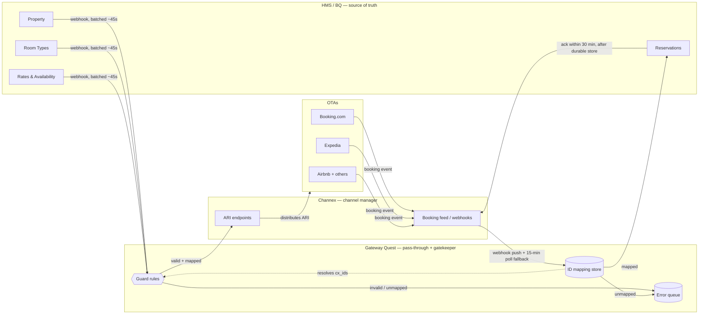
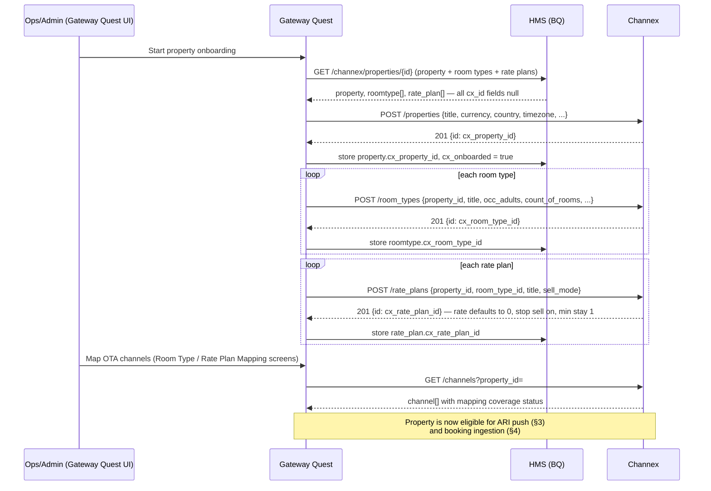
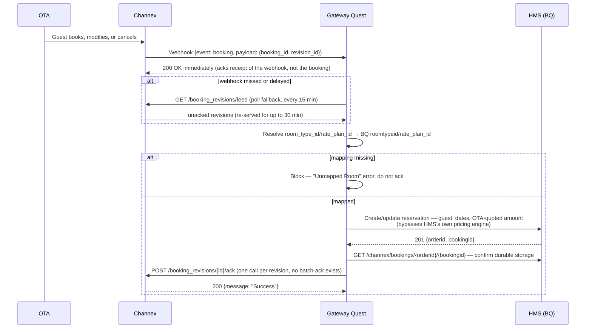
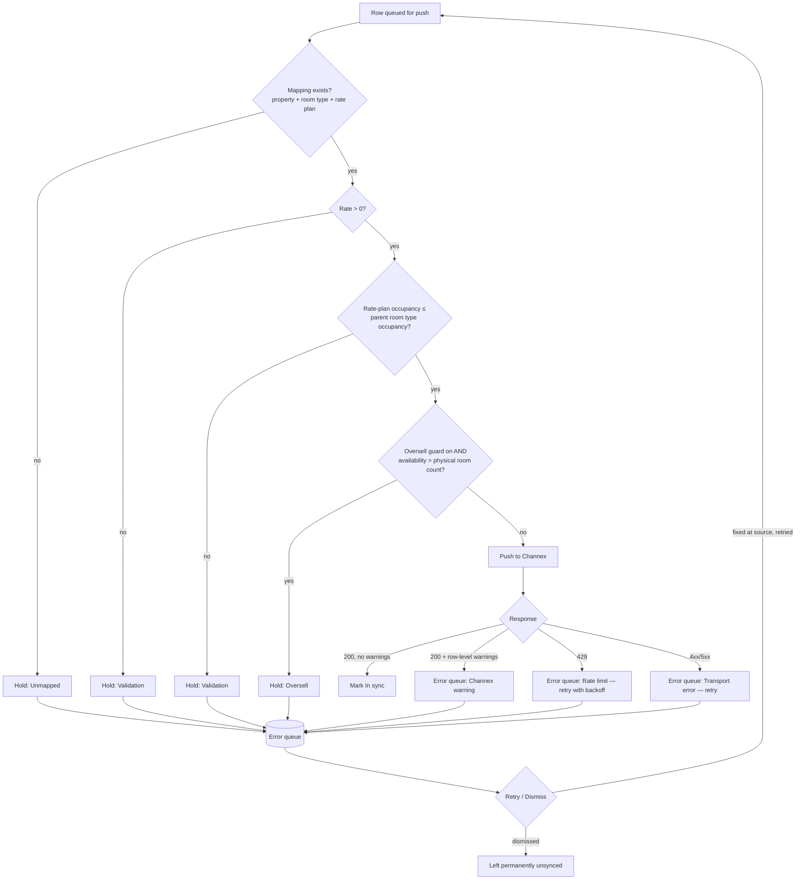
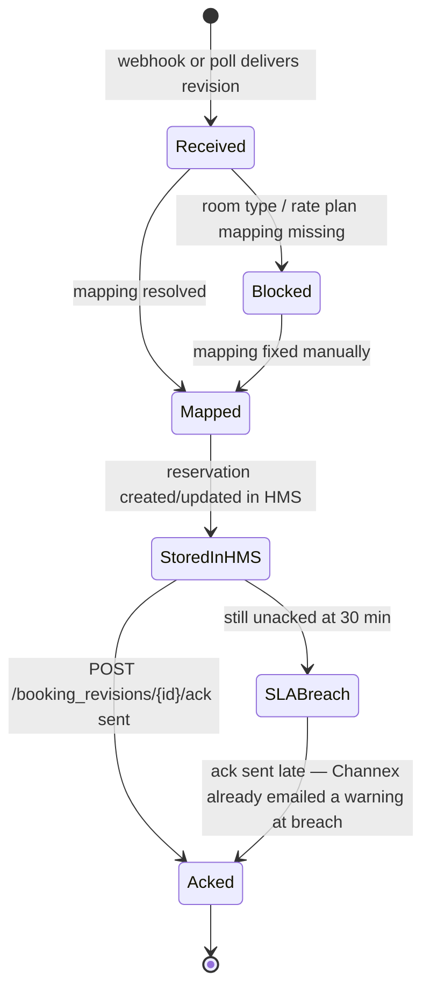

# HMS (BQ) ↔ Gateway Quest ↔ Channex — Workflow & Data Flow

Third companion to `CHANNEX_INTEGRATION_ANALYSIS.md` (architecture/gaps) and `CHANNEX_BQ_API_DB_MAPPING.md` (field-level API/DB mapping). This document is the **operational picture**: how the three systems actually talk to each other, in what order, on what triggers, and what happens when something goes wrong. Diagrams are Mermaid — they render directly in this repo's GitHub view, in VS Code, and in the published artifact version of this file.

Four actors recur in every diagram below:

- **HMS (BQ)** — the hotel management system; source of truth for property, room type, pricing, and reservations (`bq/backend`).
- **Gateway Quest** — the middleware; never edits HMS data, only validates, batches, and forwards it, or blocks it with a reason (see `CHANNEX_INTEGRATION_ANALYSIS.md` §0.3 — this component doesn't exist as code yet).
- **Channex** — the channel manager; the only system Gateway Quest talks to for distribution.
- **OTAs** — Booking.com, Expedia, Airbnb, Agoda, Hostelworld, Trip.com — reachable only through Channex, never directly.

---

## 1. System overview

The three systems form two independent loops, not one round-trip: HMS pushes rates/availability outward; Channex pushes bookings back in. Neither loop waits on the other.



**Reading this diagram:** the top loop (HMS → Gateway Quest → Channex → OTA) is one-directional and rate/availability-only. The bottom loop (OTA → Channex → Gateway Quest → HMS) is one-directional and booking-only. They share only the ID-mapping store — a booking can't be accepted if its room type/rate plan was never mapped in the top loop's onboarding step (§2).

---

## 2. Onboarding & mapping

Runs once per property (and again whenever a room type or rate plan is added), before any ARI or booking traffic can flow. This is the step that creates every `cx_*_id` referenced everywhere else in this document.



Field-level request/response detail for every call above is in `CHANNEX_BQ_API_DB_MAPPING.md` §1–§3. Note the flag from that document: a freshly created rate plan is **not** immediately sellable — its rate is 0 and stop-sell is on until the first ARI push (§3) sets real values.

---

## 3. ARI push — HMS → Gateway Quest → Channex → OTA

Runs continuously, triggered by any rate/availability/restriction change in HMS (a pricing update, a booking that consumes inventory, a manual restriction edit). Availability and rates/restrictions are always two separate Channex calls, never combined.

```mermaid
sequenceDiagram
    participant BQ as HMS (BQ)
    participant GQ as Gateway Quest
    participant CX as Channex
    participant OTA as OTAs

    Note over BQ: Rate, availability, or restriction changes
    BQ->>GQ: Webhook push, batched ~45s per property
    GQ->>GQ: Guard rules (§5) — mapping exists? rate &gt; 0?<br/>occupancy ≤ room type? oversell check?

    alt guards fail
        GQ->>GQ: Hold row, log reason — visible on Inbound ARI Status
    else guards pass
        par availability
            GQ->>CX: POST /availability {property_id, room_type_id, date, availability}
        and rates &amp; restrictions
            GQ->>CX: POST /restrictions {property_id, rate_plan_id, date, rate (minor units), min_stay_arrival, max_stay, cta, ctd, stop_sell}
        end
        CX-->>GQ: 200 {data: [task id]}, meta.warnings[]
        alt warnings present
            GQ->>GQ: Route affected rows to error queue (§5)
        else clean
            GQ->>GQ: Mark row "In sync"
        end
        CX->>OTA: Distributes updated ARI (Channex-internal, no direct GQ↔OTA contact)
    end

    Note over BQ,CX: Nightly: full ARI refresh resent per property,<br/>independent of the 45s change-triggered batches
```

**Rate limit to design around:** 10 Availability requests/min/property and 10 Restrictions requests/min/property (confirmed from Channex docs, `CHANNEX_BQ_API_DB_MAPPING.md` §4.2) — the batching window exists specifically to stay under this, not just to reduce chatter.

---

## 4. Booking ingestion — OTA → Channex → Gateway Quest → HMS

The reverse loop. Webhook is primary; polling is a mandatory fallback, not an alternative — Channex's own docs describe webhooks as best-effort.



**Why the confirm-then-ack step matters:** acknowledging early means Channex never resends that revision — if HMS's write actually failed, the booking is lost with no recovery path. The confirm read against HMS is what makes early-ack unnecessary.

---

## 5. Error handling & guard-rule decisions

Every row destined for Channex passes through this before it's ever sent — this is what "Gateway Quest never edits, only holds back" means concretely.



The last edge is intentional, not an oversight: dismissing an error queue entry does not resend it — the underlying HMS value stays out of sync with Channex until someone fixes the source data and it's retried.

---

## 6. Booking revision lifecycle

State machine for a single Channex booking revision, from first delivery to acknowledgement — the SLA clock referenced in §4.



---

## 7. Flow summary

| Flow | Direction | Trigger | Cadence | Primary Channex call(s) | Detail |
|---|---|---|---|---|---|
| Onboarding | HMS → GQ → CX | Manual, per property/room type/rate plan | Once, or on new inventory | `POST /properties`, `/room_types`, `/rate_plans` | §2 above, full mapping doc §1–§3 |
| ARI push | HMS → GQ → CX → OTA | Any rate/availability/restriction change in HMS | Batched ~45s/property (configurable 5–300s) + nightly full refresh | `POST /availability`, `POST /restrictions` | §3 above, mapping doc §4 |
| Booking ingestion | OTA → CX → GQ → HMS | Guest books/modifies/cancels on an OTA | Webhook (real-time) + 15-min poll fallback | `GET /booking_revisions/feed` | §4 above, mapping doc §5 |
| Booking ack | GQ → CX | After HMS confirms durable storage | Immediate, per revision, no batching | `POST /booking_revisions/{id}/ack` | §4 above, within 30-min SLA |
| Error recovery | GQ internal | Any guard-rule fail, warning, or transport error | Continuous / on retry | (re-sends whichever call failed) | §5 above |

For exact request/response JSON on every call in this table, see `CHANNEX_BQ_API_DB_MAPPING.md`. For the database tables and open architecture questions behind this workflow, see `CHANNEX_INTEGRATION_ANALYSIS.md`.
